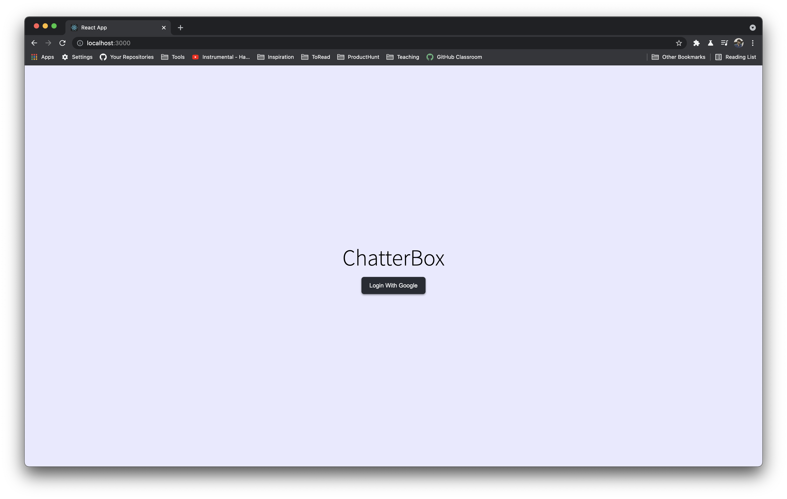

# Chat Application

Task 1: 
Make sure user can login with Google, and store information of the user like email, name and avatar.



Sample Data
```
{
  "avatar" : "https://lh3.googleusercontent.com/a-/AOh14Gh3vv4MQ-n8wsHd0fxlwK8hGrE8qo_yRMyyWtWSTsI=s96-c",
  "email" : "arnavanytime@gmail.com",
  "name" : "Arnav Puri"
}
```
